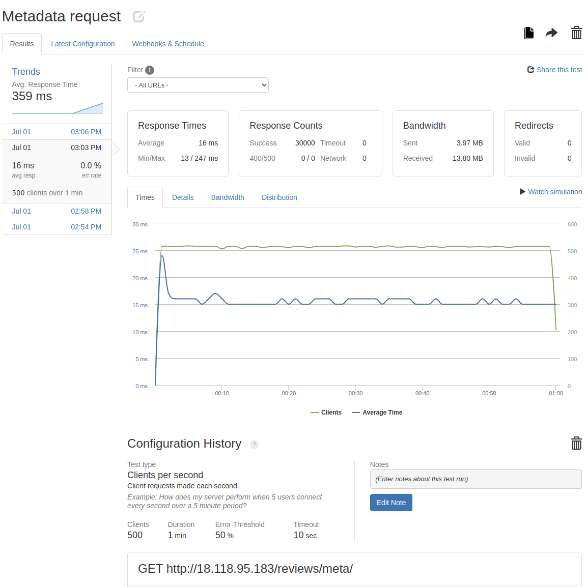
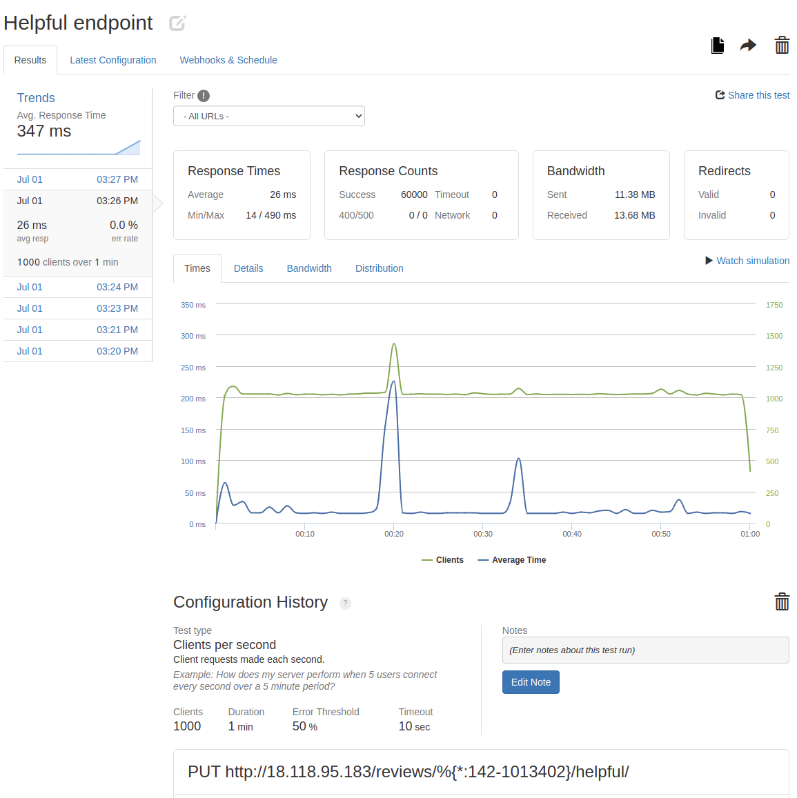
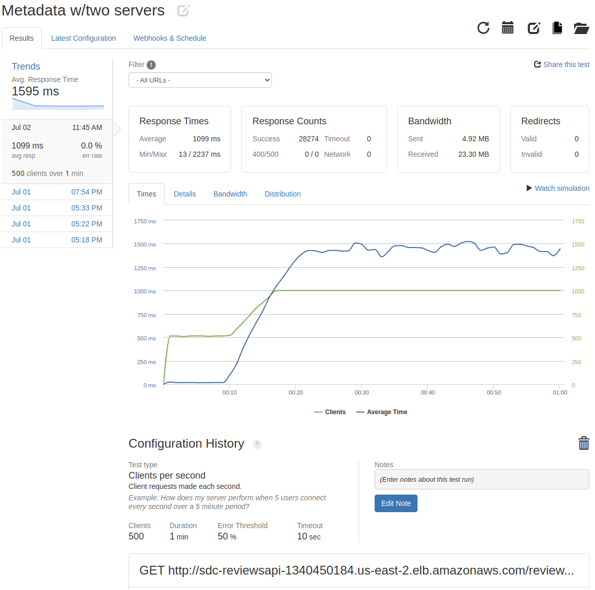

# Project Atlelier - Reviews <!-- omit in toc -->

## A RESTful API <!-- omit in toc -->

This project is about designing and implementing a RESTful API for one service on a retail web portal. Data must undergo the ETL process and all the necessary endpoints created. The goal is to design a system that is optimized and capable of horizontal scaling when necessary.

---

### Table of contents <!-- omit in toc -->

- [Description](#description)
- [Environment Setup](#environment-setup)
- [Data](#data)
  - [Database](#database)
  - [ETL](#etl)
  - [Optimization](#optimization)
- [API](#api)
  - [Endpoints](#endpoints)
  - [Deployment](#deployment)
  - [Stress Testing](#stress-testing)
  - [Horizontal Scaling](#horizontal-scaling)
- [Summary](#summary)
- [Developer](#developer)

---
---

## Description

This project is my first attempt at designing a backend system to manage large scale data storage as well as web scale traffic. The challenge is to design and implement a more optimal architecture to seamlessly replace a currently deployed system. This necessarily places some constraints on the design because it must integrate with the frontend without demanding any alteration to it. The number and type of endpoints, as well as the shape of the data for each response must map directly to the currently implemented system.

---
---

## Environment Setup

If you wish to utilize this application, ensure the following software is installed on your system:

- [Node.js](https://nodejs.org/) v14.16.1 or later
- [PostgreSQL](https://www.postgresql.org/) v13.3 or later

Fork and clone a copy of this repository to your machine and then navigate your terminal into the repo. Run `npm install` to install all the necessary [dependencies](../package.json).

Using the `psql` CLI or a GUI such as PGAdmin, create a new PostgreSQL database and ensure your user has been granted the `pg_read_server_files` privilege.

A config.js file in the project root directory is required that contains the database configuration details in the following format:

```node
module.exports.postgresConfig = {
  user: 'username',
  host: 'hostAddress', // Use 'localhost' if db and server are on the same machine
  database: 'database',
  password: 'password',
  port: 5432, // This is the Postgres default port
};
```

---
---

## Data

The data was received in four .csv files, each containing the rows extracted from one table. Combined, the files contained just over 31 million records. I've included a representative [sample](./SampleData/) of each file for reference.

### Database

The [schema](Postgres/schema.sql) for each table is designed around the shape of the incoming data and the requisite responses. Consideration is also paid to the maintainability of the records into the future by not using any nested data structures.

Postgres conveniently provides the ability to run a .sql file directly from your terminal as well as from the `psql` CLI. In the terminal simply run:

```bash
psql <username> -h <hostAddress> -d <database> -f <full path to file>
```

or in the `psql` CLI, `\c` into the desired database and run:

```bash
\i <full path to file>
```

Using one of these methods to run the schema.sql file will easily create all of the necessary tables and get set up to load the data.

### ETL

I created a .sql file for each .csv. The [files](Postgres/ETL/) each contain two queries. The first, a `COPY FROM` query that will essentially run an `INSERT INTO` for each line of the .csv, and the second, a `setval()` query that will reset the sequence for the primary key after all of the inserting is done. This method for loading data from a .csv is extremely fast and allowed me to make simple changes like changing the names of columns to better reflect the data.

### Optimization

After loading the data into Postgres, some of the queries that requires joining across tables were extremely inefficient. So inefficient that runnig the query froze my computer. I turned to indexing to speed this up. [Indexing](Postgres/ETL/Indexing.sql) all columns that are being searched for that aren't already primary keys. After indexing two columns, the queries were quick enough to run some tests. Using [Artilley.io](https://artillery.io/), I simulated hitting a single endpoint with 20 users a second for 20 seconds with a timeout of 10 seconds and received the following results:

```text
Duration: 20 Arrival Rate: 20
Scenarios launched: 400
Scenarios completed: 7
Requests completed: 7
Mean response/sec: 13.35
Response time (msec):
min: 3520
max: 7355
median: 6614
p95: 7355
p99: 7355
```

I then indexed the last necessary column for my queries and ran the same test again.

```text
Duration: 20 Arrival Rate: 20
Scenarios launched: 400
Scenarios completed: 400
Requests completed: 400
Mean response/sec: 19.56
Response time (msec):
min: 0
max: 79
median: 1
p95: 1
p99: 2
```

The response success rate jumped from 1.75% to 100% while the median response time decreased from 6.6 seconds to 1 millisecond.

---
---

## API

The API is a [Node.js](https://nodejs.org/) server built with the [Express](https://expressjs.com/) framework.

### Endpoints

There are five [endpoints](Server/routes/reviews.js) for this service.
1. [List of Reviews](#1-list-of-reviews)
2. [Add a New Review](#2-add-a-new-review)
3. [Mark a Review Helpful](#3-mark-review-as-helpful)
4. [Report a Review](#4-report-review)
5. [Metadata](#5-metadata)

---

#### 1. List of Reviews

`GET /reviews/` Returns a list of reviews for the given product id. This automatically filters out any reviews that have been reported.

###### Query Parameters <!-- omit in toc -->

|Parameter|Type|Description|
|:---:|:---:|:---|
|page|integer|Selects the page of results to return. *Default 1*|
|cout|integer|Specifies how many results per page to return. *Default 5*|
|sort|text|Changes the sort order to be based on "newest","helpful", or "relevant"|
|product_id|integer|Specifies the product for which to retrieve reviews|

###### Response <!-- omit in toc -->

`Status: 200 OK`

```JSON
{
    "product": "11007",
    "page": 0,
    "count": 5,
    "results": [
        {
            "review_id": 288544,
            "rating": 4,
            "summary": "Amazing!",
            "recommend": true,
            "response": null,
            "body": "This is my favorite thing",
            "date": "2021-03-09T00:00:00.000Z",
            "reviewer_name": "Dave",
            "helpfulness": 6,
            "photos": [
                {
                    "id": 496622,
                    "url": "y"
                },
                {
                    "id": 496623,
                    "url": "x"
                }
            ]
        },
    ]
}
```

---

#### 2. Add a New Review

`POST /reviews/` Adds a review for the given product id.

###### Body Parameters <!-- omit in toc -->

|Parameter|Type|Description|
|:---:|:---:|:---|
|product_id|integer|Required ID of the product to post the review for|
|rating|integer|Integer (1-5) indicating the review rating|
|summary|text|Summary text of the review|
|body|text|Continued or full text of the review|
|recommend|boolean|Value indicating if the reviewer recommends the product|
|name|text|Username for question asker|
|email|text|Email address for question asker|
|photos|[text]|Array of text urls that link to images to be shown|
|characteristics|object|Object of keys representing characteristic_id and values representing the review value for that characteristic.|

###### Response <!-- omit in toc -->

`Status: 201 CREATED`

---

#### 3. Mark Review as Helpful

`PUT /reviews/:review_id/helpful` Updates a review to show it was found helpful.

###### URL Parameters <!-- omit in toc -->

|Parameter|Type|Description|
|:---:|:---:|:---|
|review_id|integer|ID of the review to update. *Required*|

###### Reponse

`Status: 204 No Content`

---

#### 4. Report Review

`PUT /reviews/:review_id/report` Updates a review to show it was reported. *Note:* this action does not delete the review, but the review will not be returned GET requests.

###### URL Parameters <!-- omit in toc -->

|Parameter|Type|Description|
|:---:|:---:|:---|
|review_id|integer|ID of the review to update. *Required*|

###### Reponse

`Status: 204 No Content`

---

##### 5. Metadata

`PUT /reviews/meta` Returns review metadata for a given product.

###### Query Parameters <!-- omit in toc -->

|Parameter|Type|Description|
|:---:|:---:|:---|
|product_id|integer|Specifies the product for which to retrieve data. *Required*|

###### Reponse

`Status: 204 No Content`

```JSON
{
    "product_id": "11008",
    "ratings": {
        "1": "1",
        "2": "1",
        "3": "3",
        "4": "5",
        "5": "1"
    },
    "recommended": {
        "false": "3",
        "true": "8"
    },
    "characteristics": {
        "Size": {
            "id": 36850,
            "value": "3.6"
        },
        "Width": {
            "id": 36851,
            "value": "3.2"
        },
        "Comfort": {
            "id": 36852,
            "value": "2.8"
        },
        "Quality": {
            "id": 36853,
            "value": "3.2"
        }
    }
}
```

---

#### Deployment

The server is deployed on an [AWS](https://aws.amazon.com/) EC2 instance. It's a T2.micro with an Ubuntu 20.04 LTS image. It has 1GB of RAM and a 8GB SSD for storage.

The database is deployed on its own AWS EC2 instance with all the same specifications except for an additional 8GB of SSD storage.

The two instances are connected via networking inside of AWS's [VPC](https://docs.aws.amazon.com/AWSEC2/latest/UserGuide/using-vpc.html) for optimal performance with minimal latency.

---

#### Stress Testing

For stress testing I used the [Loader.io](https://loader.io/) cloud based testing suite. My test is configured for a desired number of clients per seconds for a determined duration. I didn't want the DBMS's caching to skew the results, so each client is given a randomly generated product id.

###### Metadata Endpoint  <!-- omit in toc -->

The metadata endpoint is the hardest on the database. It contains two sequential queries, one of which involves a `JOIN`. Even with the limited hardware of the T2.micro, the service is able to sustain over 500 concurrent users per second for one minute with an impressive 16ms average response time.



###### Helpful Endpoint  <!-- omit in toc -->

The helpful endpoint also contains two sequential queries, but each is simply to a single value that is indexed for speed. This query is able to handle over 1000 concurrent users per second for one minute with 26ms average response time.



---
---

#### Horizontal Scaling

The process of scaling servers to handle more traffic is quite simple, albeit manual. Create another EC2 T2.micro and set it up just like the first.

Having spun up a second server, I looked into the load balancer offering from AWS. Implementing the load balancer from within the AWS is extremely easy and allows AWS to do the majority of the configuration.

However, when running stress tests with Loader on the dual server/load balancer system, there are extreme performance drops.



I investigated spreading the instances across availability zones, but this didn't result in any discernable differences. The main challenge for future development on this project will be troubleshooting this functionality.

---
---

### Summary

This project is an exploration into system design with the sole purpose of gaining experience and knowledge. Starting with over 31 million records in .csv files, we loaded the data into a fresh database, transforming it as needed in the process. After getting some benchmarks, we optimized the performance of our database by indexing the necessary columns. We established routes for each of the five endpoints and wrote algorithms to shape the data before responding. We deployed the system using AWS's EC2 service with an instance for the database and another instance for each server. We used Loader cloud based testing suite to stress test our server.

---
---

### Developer

###### Timothy Parrish

I worked for over 15 years in the live event industry, (including theatre, corporate, concert, and marketing sectors). In April of 2021, I decided to enroll in Hack Reactor's Software Engineering Immersive, a high-intensity coding bootcamp. This project is the result of one assignment while attending the immersive. It was implemented in weeks 8 and 9 of the program. With the breadth of experience I have gained throughout this process I am excited to pursue a career as a full-stack web developer.